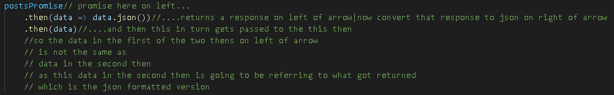
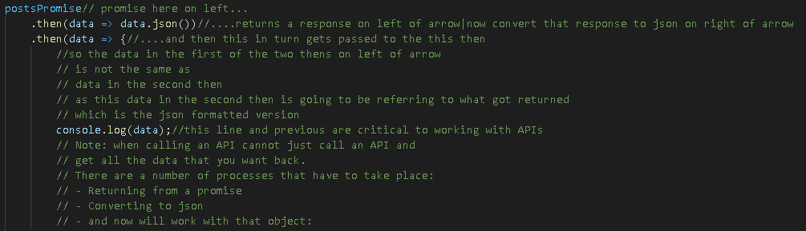
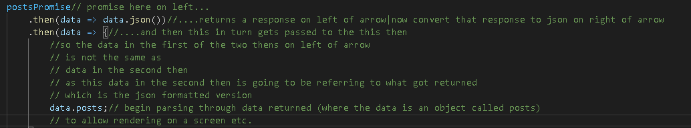
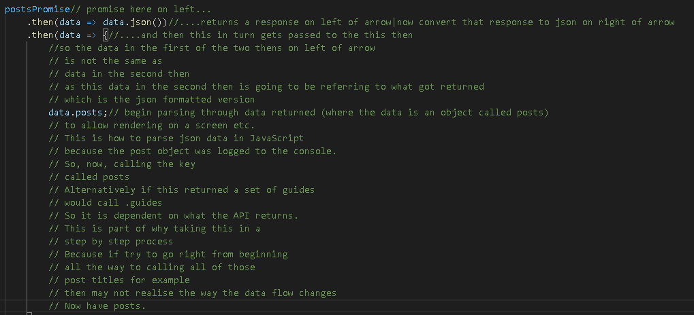
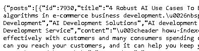
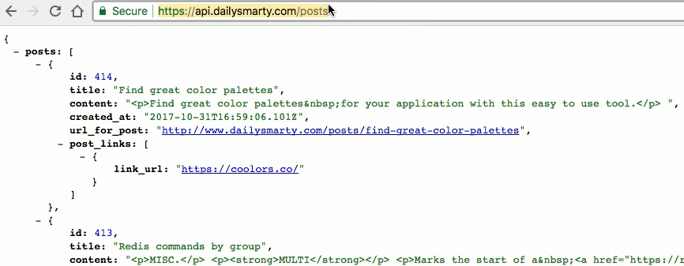

# Communicate-with-a-Real-API-in-Vanilla-JavaScript-Following-Tutorial
https://www.youtube.com/watch?v=12iA-xSuM4E&amp;t=339s This guide examines how you can utilize tools such as fetch and promises to communicate and parse a real API with vanilla JavaScript.

## Description Detail
- Following Video Tutorial (link above) to "Communicate with a Real API in Vanilla JavaScript"

## IDE
- gitpod using Visual Studio Code pushing to github

## Steps
### Step 1
- Reproduced code from video to 3 minutes and 57 seconds
### Step 2
- Add code from this Repository:
    https://github.com/Coder731/How-to-use-external-JavaScript-files-in-an-HTML-file-Following-Website-Instructions
    - code copied:
        - all in index.html
    - edit function call
    - edit JavaScript file path
### Step 3
- Continue video from 3 minutes and 57 seconds from Step 1 above.

## Notes
### Step 3 Note 1

### Step 3 Note 2

### Step 3 Note 3

### Step 3 Note 4

### Step 3 Note 5

### Step 3 Note 6
https://api.dailysmarty.com/posts is API location 
### Step 3 Note 7

## References

- [Functions](https://www.w3schools.com/js/js_functions.asp)